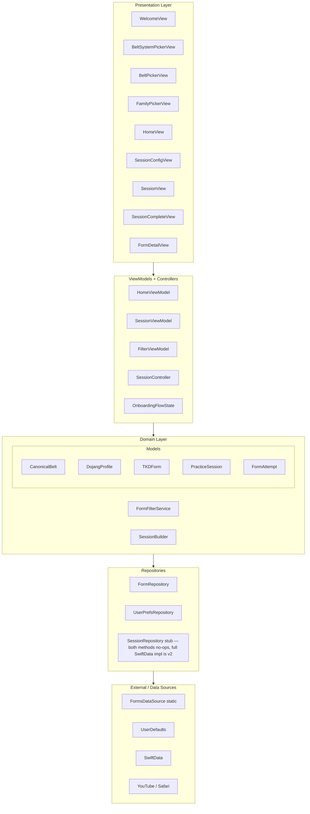
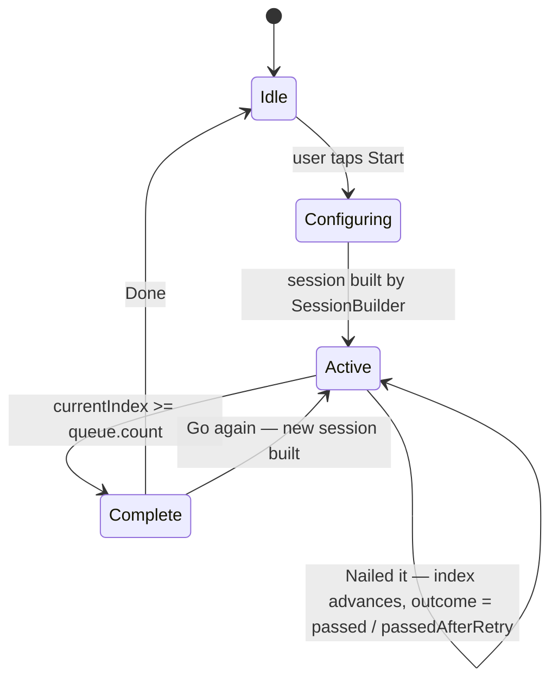
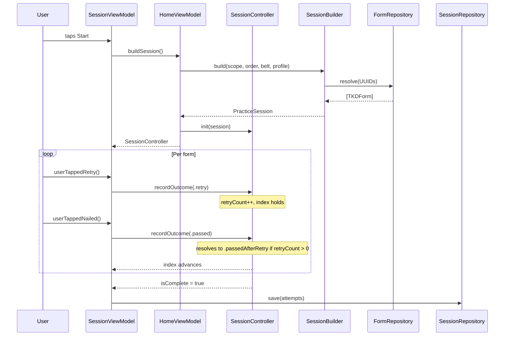
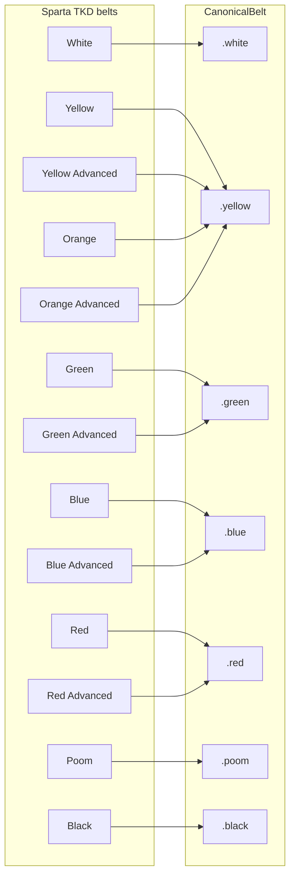

```mermaid
gantt
    title PoomsaeFlow — Build sequence
    dateFormat X
    axisFormat Step %s

    section Step 1
    Core models + FormsDataSource    :s1, 0, 1

    section Step 2
    FormFilterService (TDD)          :s2, 1, 2
    SessionBuilder (TDD)             :s2b, 1, 2

    section Step 3
    SessionController (TDD)          :s3, 2, 3

    section Step 4
    FormRepository                   :s4, 3, 4
    UserPrefsRepository              :s4b, 3, 4
    SessionRepository stub           :s4c, 3, 4

    section Step 5
    HomeViewModel                    :s5, 4, 5
    SessionViewModel                 :s5b, 4, 5
    FilterViewModel                  :s5c, 4, 5

    section Step 6
    UI — inside-out                  :s6, 5, 6
```

# PoomsaeFlow — Architecture Diagrams

## Layer architecture



---

## Session state machine



---

## Data flow — session lifecycle



---

## Belt eligibility — CanonicalBelt mapping



---

## File structure

```
PoomsaeFlow/
├── App/
│   └── PoomsaeFlowApp.swift
├── ContentView.swift                          ← composition root — instantiates concrete repos,
│                                                wires ViewModels, handles -uitesting flag
├── Domain/
│   ├── Models/
│   │   ├── CanonicalBelt.swift
│   │   ├── BeltLevel.swift
│   │   ├── BeltSystemPreset.swift
│   │   ├── DojangProfile.swift
│   │   ├── TKDForm.swift
│   │   ├── VideoResource.swift
│   │   ├── FormFamily.swift
│   │   ├── PracticeSession.swift
│   │   ├── SessionScope.swift
│   │   ├── SessionOrder.swift
│   │   └── FormAttempt.swift
│   ├── Preferences/
│   │   ├── TrainingProfile.swift
│   │   ├── SessionDefaults.swift
│   │   ├── PinnedForms.swift
│   │   └── OnboardingState.swift
│   ├── Services/
│   │   ├── FormFilterService.swift
│   │   └── SessionBuilder.swift
│   └── Controllers/
│       └── SessionController.swift
├── Data/
│   ├── Repositories/
│   │   ├── FormRepository.swift
│   │   ├── UserPrefsRepository.swift
│   │   └── SessionRepository.swift
│   └── DataSources/
│       └── FormsDataSource.swift
├── Presentation/
│   ├── Common/
│   │   └── Color+Hex.swift
│   ├── Onboarding/
│   │   ├── WelcomeView.swift
│   │   ├── BeltSystemPickerView.swift
│   │   ├── BeltPickerView.swift
│   │   ├── FamilyPickerView.swift
│   │   └── OnboardingFlowState.swift
│   ├── Home/
│   │   └── HomeView.swift
│   ├── Session/
│   │   ├── SessionConfigView.swift
│   │   ├── SessionView.swift
│   │   └── SessionCompleteView.swift
│   └── FormDetail/
│       └── FormDetailView.swift
├── ViewModels/
│   ├── HomeViewModel.swift
│   ├── SessionViewModel.swift
│   └── FilterViewModel.swift
├── Resources/
│   └── Assets.xcassets
├── PoomsaeFlowTests/
│   ├── FormFilterServiceTests.swift
│   ├── SessionBuilderTests.swift
│   ├── SessionControllerTests.swift
│   ├── HomeViewModelTests.swift
│   └── OnboardingFlowStateTests.swift
└── PoomsaeFlowUITests/
    ├── AppLaunchTests.swift
    ├── OnboardingUITests.swift
    ├── PinnedFormsUITests.swift           ← intentionally failing — documents known bug
    └── XCUIApplication+Helpers.swift
```

---

## Build order (Step 1 → 6) — Historical, v1 complete



---

## DojangProfile — form catalog gating

`DojangProfile.formIDs` is `Set<UUID>?`:
- `nil` — no filter, all catalog forms are visible (Standard WT behavior in v1)
- non-nil `Set` — only the listed UUIDs are eligible; membership tests dominate over iteration, which is why `Set` is used over `Array`
- empty `Set` — no forms visible (different from `nil`; do not conflate the two)

This nil-as-sentinel is the gating mechanism for v1.1 dojang-specific catalogs. When building a `DojangProfile` for a dojang that teaches all WT forms, set `formIDs` to `nil`, not to a full set of all UUIDs.

---

## Accessibility identifier convention

Pattern: `<context>_<element_type>_<value>`

Examples:
- `belt_system_row_spartaTKD`
- `belt_row_White`
- `belt_form_row`
- `pin_button`

All UITest queries use this convention. Apply it to any new identifiers added for v1.1 UITests.
